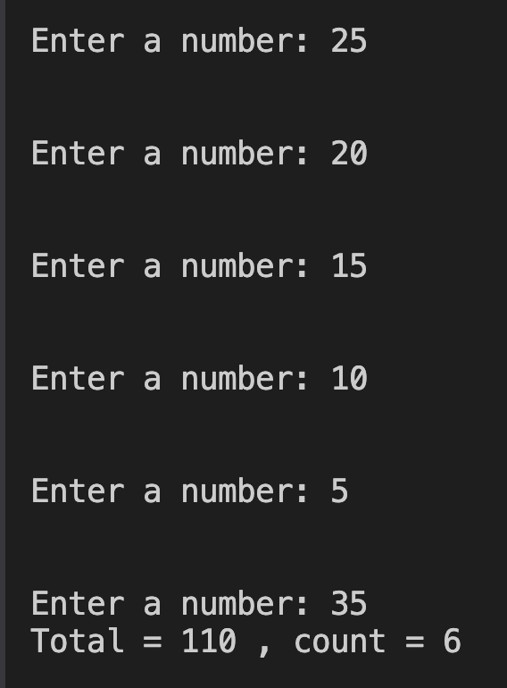

# 5. Question - Program That Stops When the Sum of Numbers Exceeds 100

**Question Description:**
Write the C code that will stop when the sum of the entered numbers exceeds 100 and print the total and the count of numbers.

**Sample Screen Output:**

