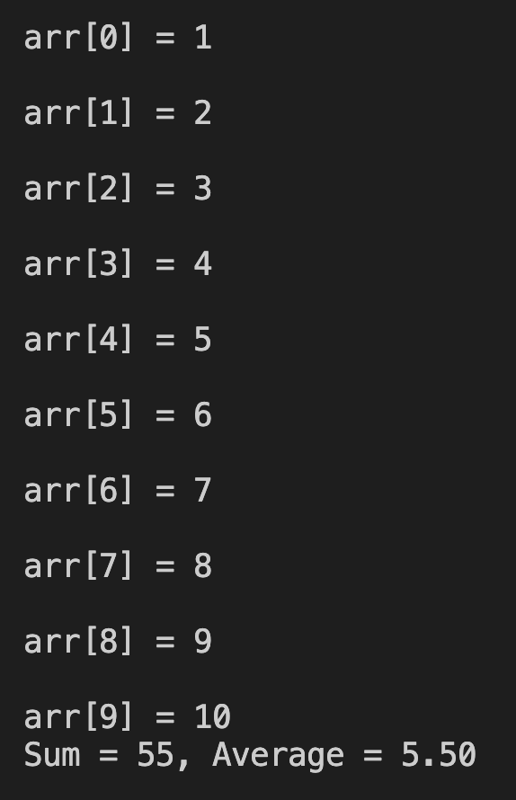

# 8. Question - Calculating Sum and Average with 10 Numbers

**Question Description:**
Enter random numbers from the keyboard into an array of 10 elements.  
Write the C code that calculates the sum and average of the numbers.

**Sample Screen Output:**

