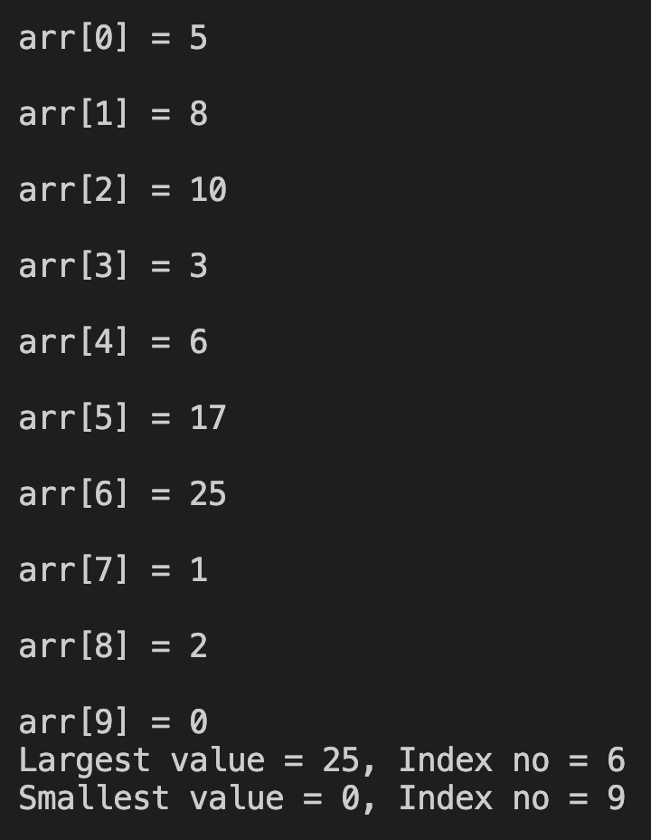

# 9. Question - Values and Indexes of the Largest and Smallest of 10 Numbers

**Question Description:**
Write the C code that finds the values and index numbers of the largest and smallest numbers from the numbers entered into a 10-element array.

**Sample Screen Output:**

