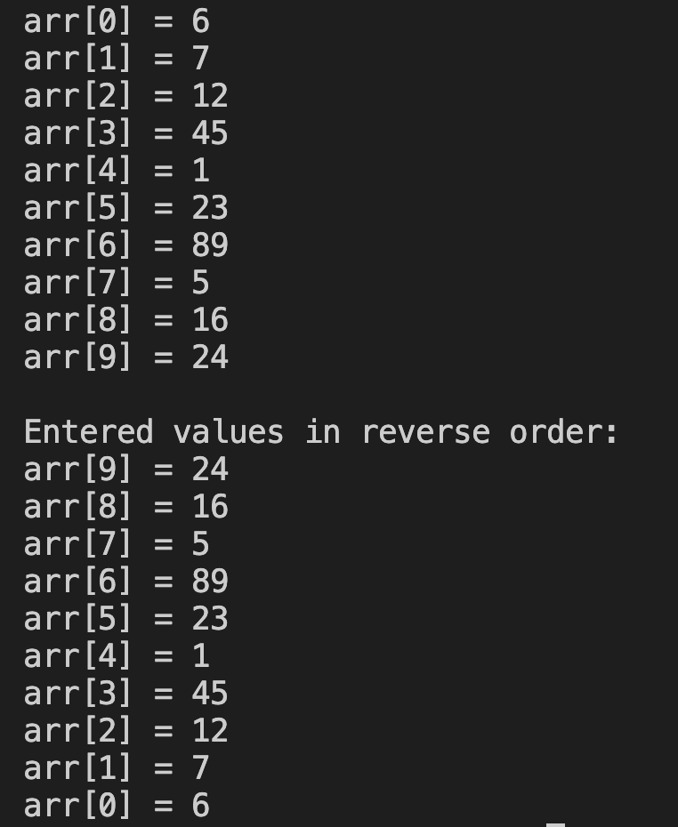

# 10. Question - Displaying Array Elements in Reverse Order

**Question Description:**
Write the C code that prints the values entered into a 10-element array in reverse order.

**Sample Screen Output:**

