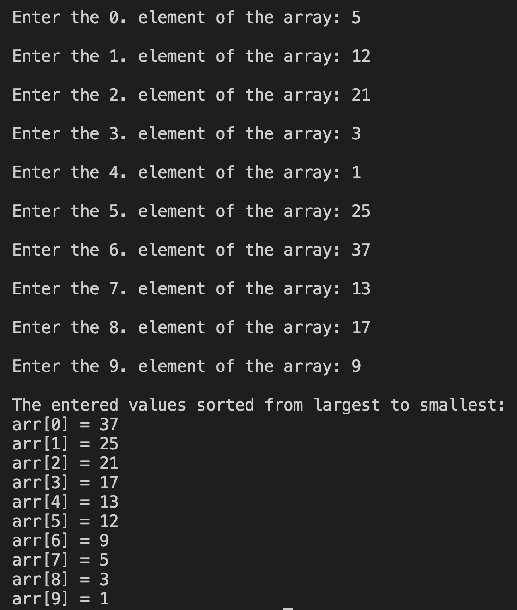

# 12. Question - Sorting an Array from Largest to Smallest

**Question Description:**
Write the C code that sorts the numbers entered into a 10-element array from largest to smallest.

**Sample Screen Output:**

