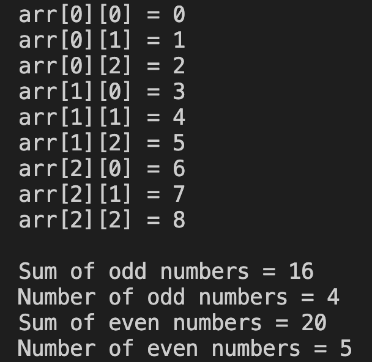

# 14. Question - Summing Odd and Even Numbers in a Matrix

**Question Description:**
Write the C code that creates a 3x3 matrix, sums the entered numbers separately as odd and even, and prints these sums along with their counts to the screen.

**Sample Screen Output:**

 
