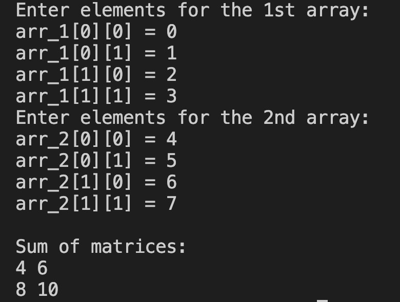

# 15. Question - Sum of Matrices

**Question Description:**
Write the C code that creates two 2x2 matrices, takes numbers from the keyboard for each, and assigns the sum of these two matrices to a different matrix and prints it to the screen.

**Sample Screen Output:** 

