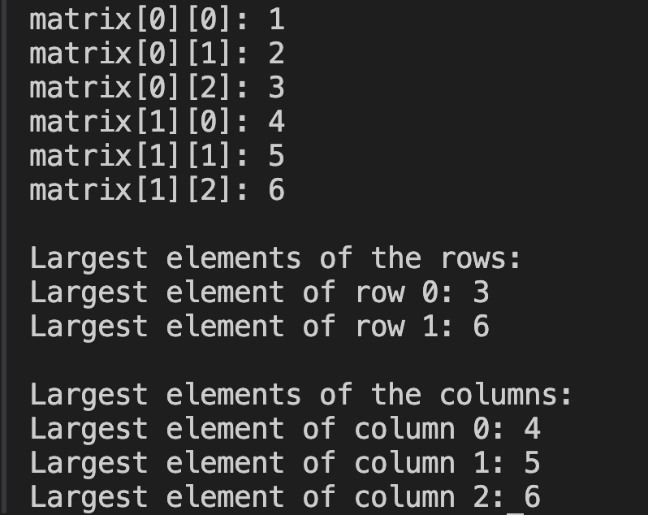

# 16. Question - Largest Numbers in a 2x3 Matrix

**Question Description:**
Write the C code that creates a 2x3 matrix and prints the largest numbers in each row and column to the screen.

**Sample Screen Output:**

