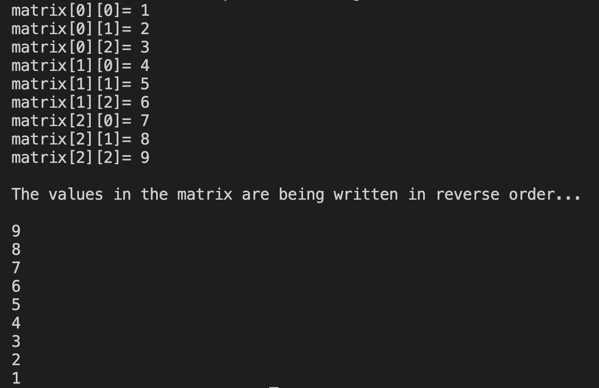

# 17. Question - Printing the Matrix in Reverse Order

**Question Description:**
A 3x3 matrix is created and random numbers are entered into the matrix from the keyboard. Accordingly, write the C code that prints this matrix to the screen in reverse order.

**Sample Screen Output:** 

