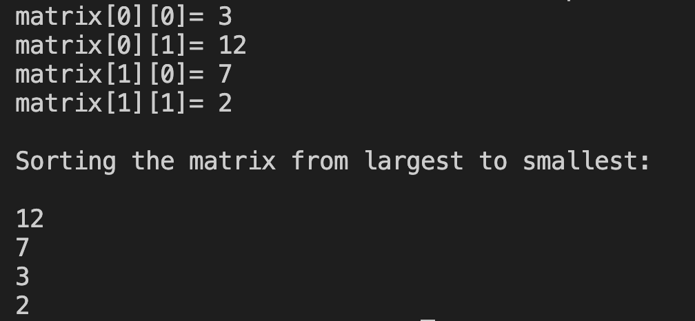

# 18. Question - Sorting the Numbers of a 2x2 Matrix

**Question Description:**
A 2x2 matrix is created and random numbers are entered into the matrix from the keyboard. Write the C code that sorts the entered numbers from largest to smallest and prints them to the screen.

**Sample Screen Output:**

