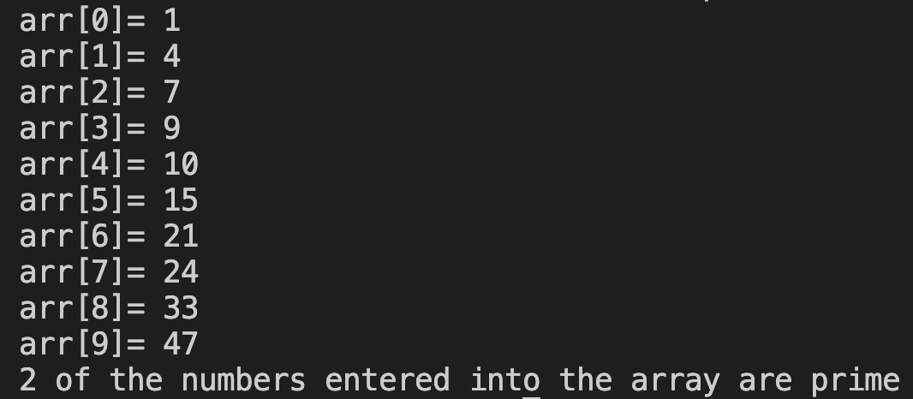

# 19. Question - Counting Prime Numbers in an Array

**Question Description:**
A 10-element array is created and numbers are entered into the array from the keyboard. Write the C code for a function that prints to the screen how many of the numbers entered into the array are prime.

**Sample Screen Output:** 

