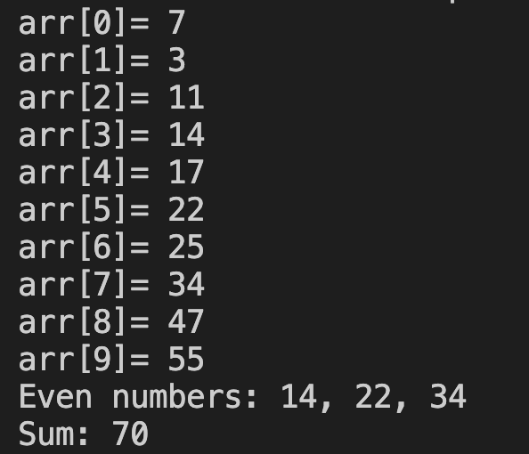

# 20. Question - Even Numbers in the Array and Their Sum

**Question Description:**
A 10-element array is created and random numbers are entered into the array. Write the C code for a function that prints the even numbers from the entered values and the sum of the even numbers to the screen.

**Sample Screen Output:** 

