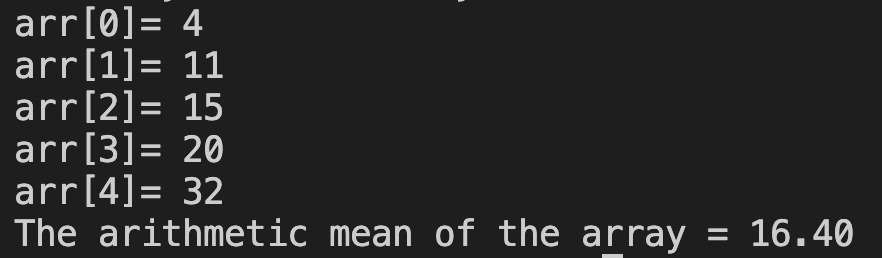

# 21. Question - Calculating Arithmetic Mean for an N-Element Array

**Question Description:**
An N-element array is created and random numbers are entered into the array. Write the C code for a function that calculates the arithmetic mean of the entered numbers and prints it to the screen.

**Sample Screen Output:**

