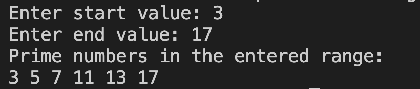

# 22. Question - Finding and Printing Prime Numbers in a Given Range

**Question Description:**
Write the C code for a function that finds the prime numbers in a given range, saves them to an array, and prints them to the screen.

**Sample Screen Output:**

