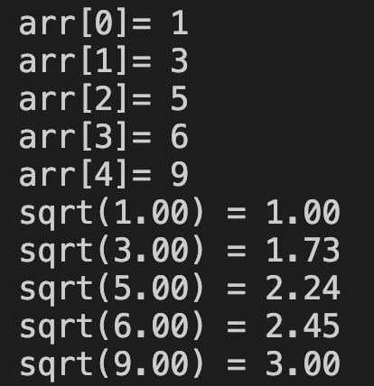

# 23. Question - Calculating and Printing the Square Root of Entered Numbers

**Question Description:**
A 5-element array is created and random numbers are entered into the array from the keyboard. 
Write the C code for a function that calculates the square root of the entered numbers and prints it to the screen.

**Sample Screen Output:**

