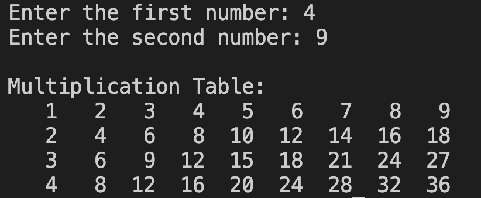

# 24. Question - Creating a Multiplication Table

**Question Description:**
A multiplication table is created based on two random numbers received from the user, and these values are saved to an array. 
Write the C code that prints the created array to the screen.

**Sample Screen Output:**

