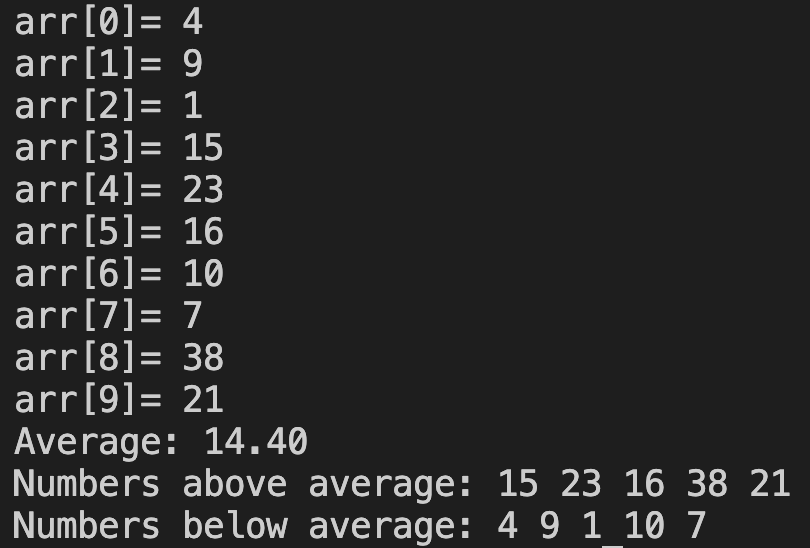

# 25. Question - Classifying Numbers by Calculating the Average Value

**Question Description:**
A 10-element array is created and random numbers are entered into the array from the keyboard.
Write the C code that calculates the average of the entered numbers and prints the numbers as those below and above the average to the screen.

**Sample Screen Output:**

