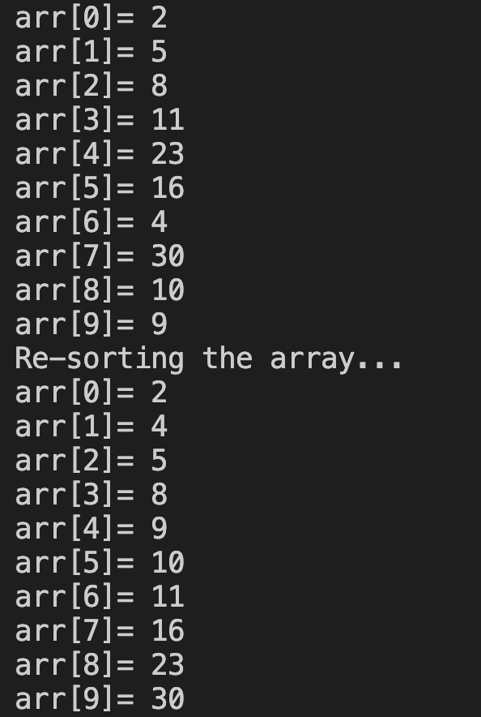

# 26. Question - Sorting Array Elements from Smallest to Largest

**Question Description:**
A 10-element array is created and random numbers are entered into the array from the keyboard.
Write the C code that sorts the entered numbers from smallest to largest and prints them to the screen.

**Sample Screen Output:** 

