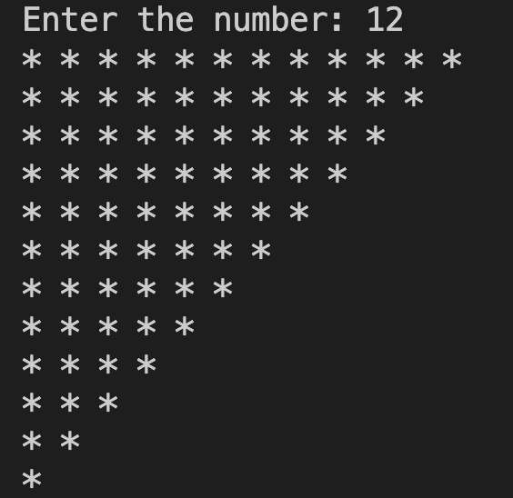

# 27. Question - Creating an Inverted Triangle Array

**Question Description:**
Write the C code that creates an inverted triangle based on a randomly entered number from the keyboard, puts it into an array, and prints the array to the screen.

**Sample Screen Output:**

