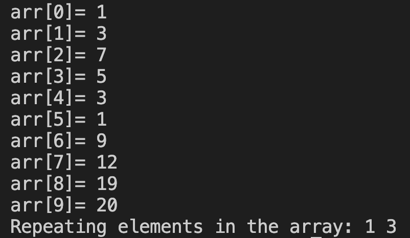

# 28. Question - Finding Repeating Numbers

**Question Description:**
A 10-element array is created and random numbers are entered into the array from the keyboard. Write the C code that finds the repeating numbers among the numbers and prints them to the screen.

**Sample Screen Output:** 

