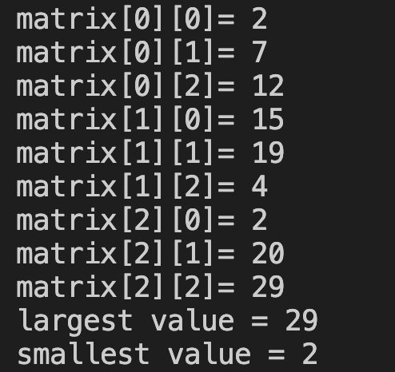

# 29. Question - Finding the Largest and Smallest Number in a Matrix

**Question Description:**
A 3x3 matrix is created and random numbers are entered into the matrix from the keyboard. Write the C code that finds the largest and smallest number in the matrix and prints it to the screen.

**Sample Screen Output:**

