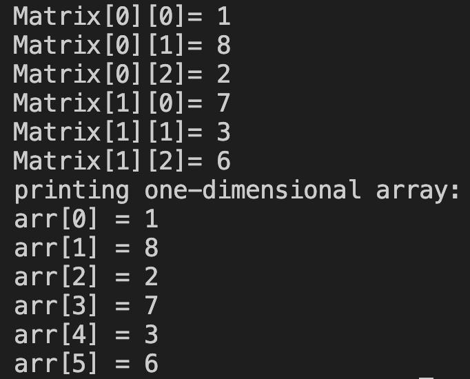

# 30. Question - Converting a 2x3 Matrix to an Array

**Question Description:**
A 2x3 matrix is created, and numbers are entered into the matrix from the keyboard. Write the C code that converts the created matrix into a one-dimensional array and prints it to the screen.

**Sample Screen Output:** 

