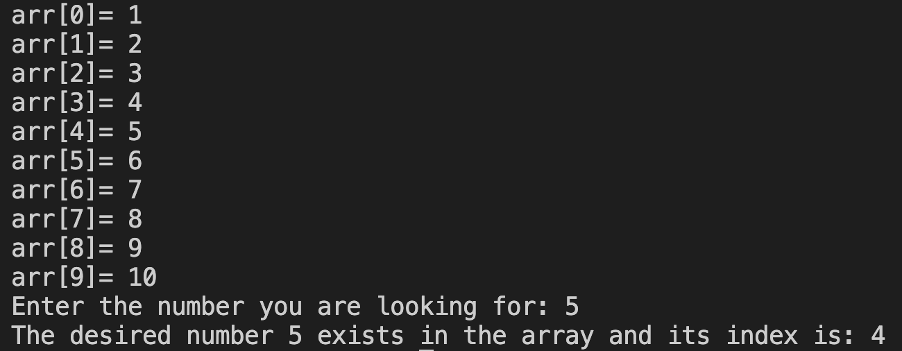
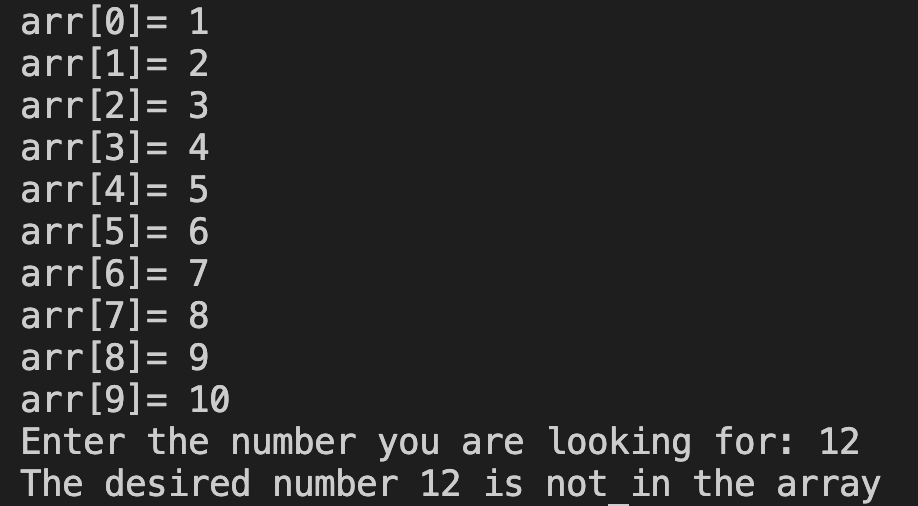

# 31. Question - Number Search in Array

**Question Description:**
A 10-element array is created and random values are entered into the array from the keyboard. Write the C code for a function that checks whether the desired number is in the array.

**Sample Screen Output:** 

**Sample Screen Output:** 

