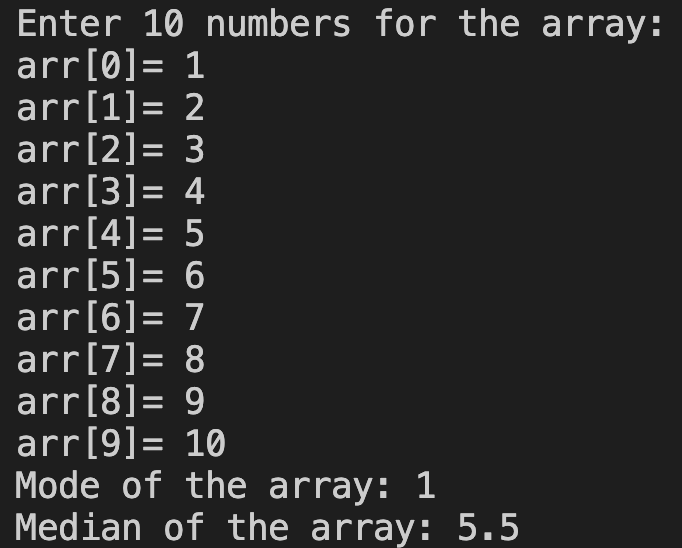

# 32. Question - Calculating the Mode and Median Values of the Array

**Question Description:**
A 10-element array is created and random values are entered into the array from the keyboard. Write the C code for a function that calculates the mode and median values of the array and prints them to the screen.

**Sample Screen Output:** 

