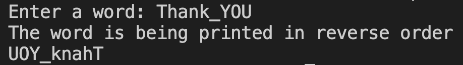

# 33. Question - Printing a Word in Reverse

**Question Description:**
A word entered randomly from the keyboard is saved into an array. Write the C code for a function that prints the entered word to the screen in reverse order.

**Sample Screen Output:**

